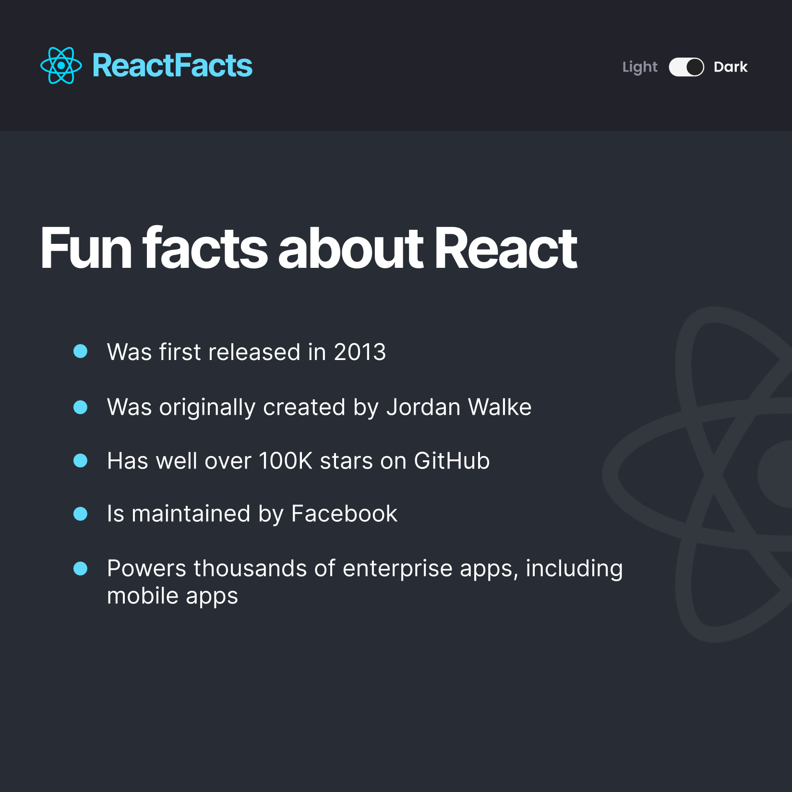

# React Info Site

### Challenge: React Info App

**Project Setup**
- Create a `components` folder
- Create the following components in separate files inside
  the components folder.  In each one, just render an `h1` 
  with the name of the component (e.g. return `<h1>Navbar goes here</h1>`)
    - Navbar
    - Main
- Create an App component outside the components folder (sibling to
  the index.js file)
    - Have App render the Navbar and Main components
- Import and render the App component inside of index.js using ReactDOM
    - At this point you should have your "Navbar goes here" etc. showing up
      in the mini-browser.
- Go to Google fonts and get the "Inter" font with weights 400, 600, and 700.
  Put the links to those fonts ABOVE the style.css link in index.html (Use
  the `<link/>` elements instead of the @import or npm options for getting
  the fonts. You may need to do some extra research to figure out how this 
  works if you haven't done it before)

**App Design**

Design the two components as given in the figma design below - 

  

The design was improved to include Dark and Light Modes

  
  

